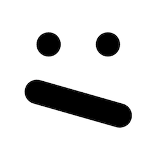
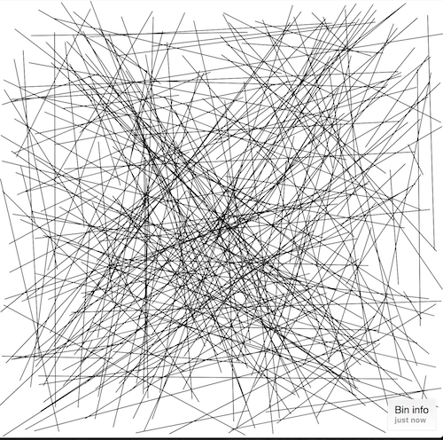
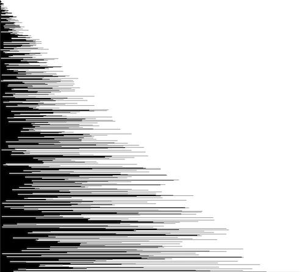
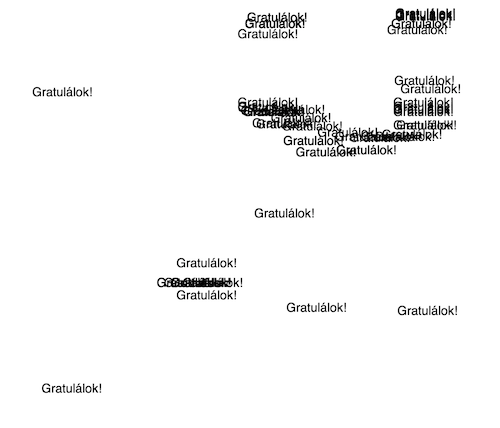
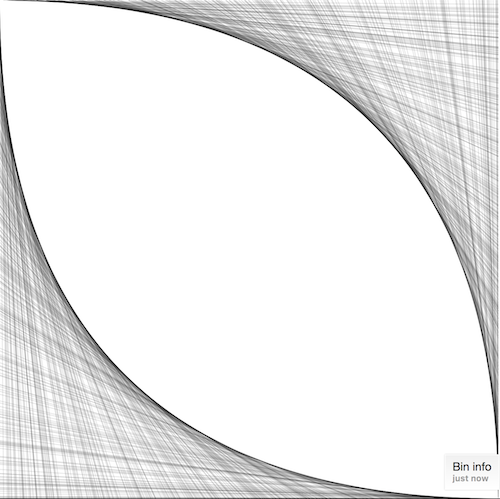
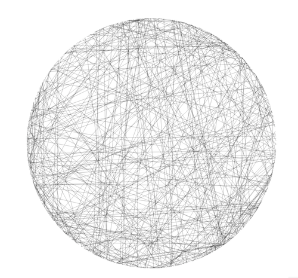
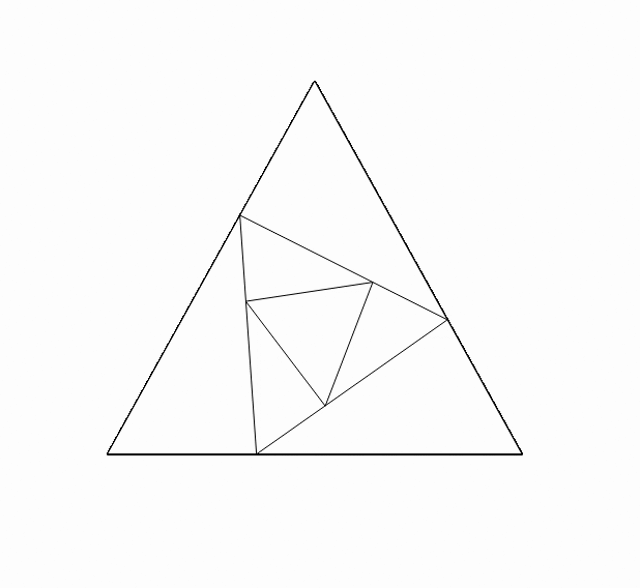

# Negyedik óra: grafika (jegyzet)

Paint: http://endreymarcell.hu/p5v3/paint.html  
Vonalzó emlékeztetőül: http://output.jsbin.com/medolor/  
Bin klónozásra: http://jsbin.com/niqanin/edit?js,output  

## Statikus rajzok

### Elmélet: festék és vászon

A rajzolás p5-ben - ugyanúgy, mint Paintben - a vászonra kent festék elvén működik. Először szerezni kell egy vásznat, aztán arra tudunk különböző színű festékekkel festeni. Amit a vászonra festettünk, az már rajta marad, nem lehet utólag elmozdítani, átméretezni vagy eltüntetni. A későbbi festések "felülírják" a korábbiakat, tehát felül tudjuk festeni a korábbi rajzunkat. Ha tiszta vászonnal szeretnénk indítani, egyszerűen lefestjük az egész vásznat egyszínűre (pl. fehérre).  

### A vászon létrehozása

```JavaScript
createCanvas(windowWidth, windowHeight)
```

A program elején a vásznat a `createCanvas()` függvénnyel kell létrehozni. Ebben meg kell adni a vászon méretét is (szélesség és magasság, képpontban). Pl. `createCanvas(800, 600)` egy 800*600-as vásznat hoz létre. Tipikusan azt szeretnénk, ha a vászon kitöltené a rendelkezésére álló teret, tehát az egész ablakot. Az ablak méretét a `windowWidth` és a `windowHeight` változók tárolják. (Ezen a ponton még nem tudjuk a `width` és a `height` változókat használni, mert azok nem az ablak, hanem a vászon méreteit adják meg - a vásznat pedig épp most próbáljuk létrehozni.)  

### A vászon törlése (lefestése)

```JavaScript
paintCanvas("white")
```

A `paintCanvas()` függvény az egész vásznat a megadott színűre színezi. A színeket [ebből a listából](https://www.w3schools.com/cssref/css_colors.asp) tudjuk kiválasztani (google-lel rá kell keresni arra, hogy "css colors").

### Pontok és vonalak

Ha egy pontot szeretnénk tenni a vászonra, a `point()` függvényt kell meghívni a pont x és y koordinátájával:  
```JavaScript
point(100, 200)
point(width / 2, height / 2)
```

Ha vonalat akarunk húzni két pont között, a `line()` függvényt hívjuk meg négy koordinátával: az első pont x és y, majd a második pont x és y:  
```JavaScript
line(100, 200, width / 2, height / 2)
```

A pont/vonal színét a `stroke()` függvénnyel tudjuk beállítnai, amit még a rajzolás _előtt_ kell meghívni:  
```JavaScript
stroke("blue")
line(200, 400, width / 2, height / 2)
```

Ha nagyobb pontot, illetve vastagabb vonalat akarunk, akkor pedig a `strokeWeight()` függvényt kell hívnunk:  
```JavaScript
strokeWeight(10)
line(100, 400, 400, 400)
```


#### Feladatok
1. Rajzolj egy nagy :/ fejet a vászon közepére vastag, szürke vonalakkal!  
2. @ Rajzolj vonalkodót különböző vastagságú függőleges vonalakból! (Illetve a vastagabb csíkokat csinálhatod több, egymás mellé rajzolt, egy képpont széles vonalból is.)  

### Alakzatok

Téglalapokat a `rect()` függvény rajzol, melynek négy bemenő adata: a téglalap bal felső sarkának x és y koordinátája, a téglalap szélessége és magassága:  
```JavaScript
rect(100, 100, 400, 100)
```

Kört a `circle()` függvénnyel tudunk rajzolni, aminek a kör középpontját (x és y koordináta), illetve az átmérőjét kell megadni:  
```JavaScript
circle(width / 2, height / 2, 150)
```

A téglalap és a kör keretének színét, illetve a keret vastagságát szintén a `stroke()` és a `strokeWeight()` függvények állítják, mint a vonalakét. Ennek a körben például 5px széles, piros kerete van:  
```JavaScript
stroke("red")
strokeWeight(5)
circle(300, 300, 200)
```

Az alakzatok belsejének színét pedig a `fill()` ("kitöltőszín") állítja:  
```JavaScript
fill("chocolate")
rect(400, 100, 20, 120)
```

Ha azt szeretnénk, hogy az alakzat ne legyen semmilyen színnel kitöltve, hanem csak kerete legyen, azt a `noFill()` függvénnyel érhetjük el:  
```JavaScript
noFill()
circle(widht / 2, height / 2, 300)
```

A keretet hasonló módon a `noStroke()` kapcsolja ki.  

#### Feladatok
3. Rajzolj a :/ köré egy kört, hogy tisztességes smiley legyen!  
4. @ Rajzolj egy autót két téglalapból és két körből!  
5. @ Rajzold meg az olimpiai karikákat!  

### Szöveg

Szöveg írása a vászonra:  
```JavaScript
text("redrum", 300, 200)
```
ahol a stringet követő két szám a szöveg bal felső sarkának x és y koordinátája.  
Ha a szöveget középre szeretnénk igazítani, pl. mert a vászon közepére szeretnénk írni:  
```JavaScript
textAlign("center")
text("Stuck in the middle with you", width / 2, height / 2)
```

A szöveg méretét a `textSize()` függvény állítja:  
```JavaScript
textSize(32)
```

Betűtípust pedig a `textFont()` választ:  
```JavaScript
textFont("Comic Sans MS")
```

Ezeket természetesen a szöveg beírása (`text()`) előtt kell kiadni.  

A szöveg is alakzatnak számít, tehát lehet a keretének és a belsejének a színét változtatni. Általában érdemes a keretet kikapcsolni (`noStroke()`) és csak töltőszínt választani (`fill()`):  
```JavaScript
noStroke()
fill("firebrick")
text("another brick in the wall")
```

#### Feladatok
6. Írd a smiley fölé, hogy "Szeretem a korai kelést, mint", és alá hogy "a sós kólát", vagy amit jónak találsz.  
7. @ Írd a képernyőre nagy-nagy sárga betűkkel, hogy "CHEESE", aztán fehér körökkel "lukaszd ki" itt-ott, mintha ementáli lenne.  

---

## Mozgó rajzok

Bin klónozásra: http://jsbin.com/humufuj/edit?js,output  

Miért jó, ha a Paint program helyett kódolással rajzolunk? Azért, mert ami vonalat a Paintben meghúztunk, az már ott is marad, a kódunk viszont a változóknak és a függvényeknek köszönhetően folyamatosan változni tud.  

### Példák növekvő változóval

#### Mozgó vonal

Hogy oldjuk meg azt, hogy egy rajz mozogjon? Például van egy vonalunk a képernyő bal szélén:  
`line(0, 0, 0, 200)`  
Hogyan tudjuk megoldani, hogy ez a vonal mozogjon? Úgy, hogy amikor megadjuk a vonalat megrajzoló függvénynek a rajzolandó vonal koordinátáit, akkor fix, változatlan számok helyett _változókat_ adunk meg:  
`line(0, 0, num, 200)`  
Ebben a parancsban a vonal egyik végpontjának szélsségét az adja meg, hogy mennyi épp a `num` változó értéke. Ha a változó értéke változik, a vonal is máshova rajzolódik.  

Itt egy statikus program átalakítása lépésről lépésre:  
```JavaScript
function setup() {
    createCanvas(windowWidth, windowHeight)
    paintCanvas("white")
    line(0, 0, 0, 200)
}
```

1. Hozzunk létre egy `num` változót:  
```JavaScript
function setup() {
    createCanvas(windowWidth, windowHeight)
    paintCanvas("white")
    num = 0
    line(0, 0, 0, 200)
}
```

2. A végpont x koordinátája ne 0 legyen, hanem a `num` változó értéke:  
```JavaScript
function setup() {
    createCanvas(windowWidth, windowHeight)
    paintCanvas("white")
    num = 0
    line(0, 0, num, 200)
}
```

3. Helyezzük át a rajzoló függvényeket a `setup()`-ból a `draw()`-ba:  
```JavaScript
function setup() {
    createCanvas(windowWidth, windowHeight)
    num = 0
}

function draw() {
    paintCanvas("white")
    line(0, 0, num, 200)
}
```

A program már most is újra meg újra megrajzolja a vonalat, de egyelőre mindig ugyanoda. Használjuk ki, hogy a `num` egy változó:  

4. Módosítsuk a változónk értékét a `draw()`-ban:  
```JavaScript
function setup() {
    createCanvas(windowWidth, windowHeight)
    num = 0
}

function draw() {
    paintCanvas("white")
    line(0, 0, num, 200)
    num += 1
}
```

#### Növekvő kör

Itt egy statikus kör a vászon közepén:  
`circle(width / 2, height / 2, 100)`  

Alakítsuk át úgy, hogy növekedjen:  
```JavaScript
function setup() {
    createCanvas(windowWidth, windowHeight)
    num = 0
}

function draw() {
    paintCanvas("white")
    circle(width / 2, height / 2, num)
    num += 1
}
```

##### Feladatok

8. Rajzolj egy kört, aminek a középpontja a vászon bal felső sarka, és folyamatosan növekszik. Ha ez megvan, rajzolj egy függőleges vonalat, ami a vászon bal széléről indul, és folyamatosan jobbra halad, úgy, hogy közben végig érinti a kör szélét.  
(Ha jut időd, írd meg a vízszintes párját is, ami a vászon felső széléről halad lefelé, és adj színt a körnek.)  
9. @ JavaScriptben a % jel modulo-t, tehát a maradékos osztás maradékát jelenti. Például 12 % 10 == 2, sőt, 178 % 10 == 8. Ez arra is jó, hogy ha valami kiment a képernyő jobb szélén, az újra megjelenjen a bal szélen - egyszerűen el kell modulózni a túl nagyra nőtt x koordinátát a vászon szélességével (`x % width`) -, illetve ugyanez igaz az alsó szélre (`y % height`). - Nos, én eleve olyan programot akartam írni, ami azt rajzolja, hogy `line(num, num * 3 % height, num + 100, num * 3 % height)`, de végül oda jutottam, hogy `line(num, num * 5 % height, num * 1.5 + 100, 0)`, és ez egész jól néz ki. Kísérletezz még kicsit ezzel, játssz bármit a vonal pontjainak koordinátáival, rajzolj valami szépet és mutasd meg.  

#### Példák egérrel

##### Egeret követő szöveg

Itt egy statikus szöveg:  
`text("Ne kövess!", 300, 100)`

Alakítsuk át úgy, hogy mindig az egér aktuális helyére íródjon ki:  
```JavaScript
function setup() {
    createCanvas(windowWidth, windowHeight)
}

function draw() {
    paintCanvas("white")
    text("Ne kövess!", mouseX, mouseY)
}
```

##### Egér szerinti vastagság

  

Itt egy smiley:  
```JavaScript
function setup() {
    createCanvas(windowWidth, windowHeight)
    paintCanvas("white")
    strokeWeight(5)
    // bal szem
    point(100, 100)
    // jobb szem
    point(200, 100)
    // száj
    line(80, 180, 220, 220)
}
```

Alakítsuk át úgy, hogy a rajzolásnál a vonalak vastagsága mindig az egér aktuális x koordinátájától függjön! (De mondjuk ne egy az egyben annyi legyen, mert több száz képpont széles vonalakkal nem sok értelme van rajzolni.)  
```JavaScript
function setup() {
    createCanvas(windowWidth, windowHeight)
}

function draw() {
    paintCanvas("white")
    strokeWeight(mouseX / 10)
    point(100, 100)
    point(200, 100)
    line(80, 180, 220, 220)
}
```

##### Feladatok

10. Írd át az előző programot úgy, hogy a kör mérete, illetve a vonalak helye ne egy folyamatosan változó legyen, hanem az egérhez igazodjon - a `num` változó értéke ne növekedjen, hanem mindig az egér és a bal felső sarok távolsága legyen. Ehhez használd a `dist()` függvényt, ami négy számot vár - két pont koordinátáit - és megadja a köztük lévő távolságot.  
11. @ Rajzolj Bezier-görbét, aminek a kezdőpontja a vászon tetején, középen van, a végpontja a vászon alján középen, és mindkét fókuszpontja az egér aktuális helye. A `bezier()` függvény nyolc számot vár: a kezdőpont két koordinátáját, az első fókuszpontét, a második fókuszpontét és a második végpontét.  

#### Példák randommal

##### Véletlen vonalak

  

Itt egy fix vonal:  
`line(0, 0, 100, 100)`  
Ha azt akarjuk, hogy a vonal végpontja ne a (100, 100) pont legyen, hanem egy véletlen pont a vásznon, a `random()` függvényt kell használnunk. Ez a függvény két számot vár bemenetként, és visszaad közöttük egy véletlenszámot.  
Az első 100-as szám egy x koordinátát jelöl, tehát ha véletlenre állítjuk, akkor 0 és a vászon szélessége között tud változni, amit pedig a `width` változó tárol. A második 100-as magasságot jelöl, tehát itt `height` a maximum. Átírva:  
`line(0, 0, random(0, width), random(0, height))`  
Az első két koordinátát ugyanígy kell behelyettesítenünk:  
`line(random(0, width), random(0, height), random(0, width), random(0, height))`  

Ha ezt a parancsot a `draw()`-ba írjuk, és nem töröljük le újra meg újra a vásznat, akkor a vászon lassan telerajzolódik véletlenszerű vonalakkal:  
```JavaScript
function setup() {
    createCanvas(windowWidth, windowHeight)
    // csak egyszer fessük fehérre a vásznat
    paintCanvas("white")
}

function draw() {
    line(random(0, width), random(0, height), random(0, width), random(0, height))
}
```

##### Véletlen vonalak mozgó pontból

  

Írjunk egy programot, amiben egy pont (a vászon törlése nélkül) végighalad a vászon bal szélén lefelé:  

```JavaScript
function setup() {
    createCanvas(windowWidth, windowHeight)
    paintCanvas("white")
    num = 0
}

function draw() {
    point(0, num)
}
```

Írjuk át úgy, hogy pont helyett húz egy vízszintes vonalat 100 pixel szélesen:  
`line(0, num, 100, num)`

Legyen a vonal szélessége véletlenszerű:  
`line(0, num, random(0, width), num)`  

Még jobb: a véletlen vonal kezdetben legyen nagyon rövid, és lefelé haladva egyre szélesebb - ehhez használjuk a `random()` felső határának a már amúgy is létező változónkat:  
`line(0, num, random(0, num), num)`  

##### Feladatok

12. Lófasz
13. @ Még több lófasz

#### Példák egérkattintással

  

Írjuk ki minden egérkattintás helyére, hogy "Gratulálok":  
```JavaScript
function setup() {
    createCanvas(windowWidth, windowHeight)
    paintCanvas("white")
}

function mouseClicked() {
    text("Gratulálok!", mouseX, mouseY)
}
```

##### Feladatok

14. Lócsöcs
15. @ Még több lócsöcs

### Izgalmas példák

#### Véletlenszámok elmentése

Rajzoljunk minden pillanatban egy vízszintes vonalat a vászon bal szélétől a jobb széléig, véletlen magasságban!  
`line(0, random(0, height), width, random(0, height))`  
Ezzel van egy komoly baj - nem vízszintes. Azért nem, mert az első `random()` hívás visszaad egy véletlenszámot, aztán a második egy másikat. Arra volna szükségünk, hogy a kettő szám ugyan véletlen legyen, de ugyanaz a véletlenszám. Ezt úgy tudjuk elérni, ha elmentjük egy változóba:  
```JavaScript
num = random(0, height)
line(0, num, width, num)
```

#### Csini

Rajzoljunk ilyen csini izét:  
  

Ehhez sok véletlen vonallal kell összekötni a vászon bal szélét az alsó szélével, illetve a jobbat a felsővel. A bal és az alsó szél összekötésekor minden vonal valahogy így fog kinézni:  
`line(0, SOMETHING, SOMETHING, height)`  
mert így az első pont x koordinátája 0, tehát a vászon bal szélén van, a második pont y koordinátája pedig `height`, tehát a vászon alsó szélén van.  
A `SOMETHING` kihagyások helyére pedig mindig ugyanazt a számot kell írni - ami persze egy véletlenszám, de _ugyanaz a véletlenszám kétszer_. (Ld. az előző szakaszt.)  
A vászon felső és jobb szélét összekötő vonalak formája:  
`line(SOMETHING, 0, height, SOMETHING)`  
hasonlóan kitöltve.  

#### Véletlen vonalak egy körön belül

  

Rajzoljunk véletlen vonalakat úgy, hogy a végpontok mindig egy 500*500-as körön fekszenek! Ezt úgy tudjuk megtenni, hogy nem a pont koordinátáit generáljuk randommal, hanem a szöget (azt, hogy a középponthoz képest milyen irányban van a pont). A szög legenerálása:  
`num = random(0, 2 * PI)`  
Ehhez a szöghöz egy 250 képpont sugarú kör kerületén az a pont tartozik, aminek az x koordinátája a kör középpontjához képest plusz `250 * cos(num)` helyen van. Az y ugyanez, csak szinusszal.  

#### Háromszögek

  

Mélyvíz, csak úszóknak.  

```JavaScript
function setup() {
    createCanvas(windowWidth, windowHeight)
    paintCanvas("white")
    num = 0
    maxi = 250
}

function draw() {
    ax1 = width / 2 - 200
    ay1 = height / 2 + 200
    ax2 = width / 2 + 200
    ay2 = height / 2 + 200
    ax3 = width / 2
    ay3 = height / 2 - 160
    triangle(ax1, ay1, ax2, ay2, ax3, ay3)

    bx1 = interpolate(...)
    by1 = interpolate(...)
    bx2 = interpolate(...)
    by2 = interpolate(...)
    bx3 = interpolate(...)
    by3 = interpolate(...)
    triangle(bx1, by1, bx2, by2, bx3, by3)

    cx1 = interpolate(...)
    cy1 = interpolate(...)
    cx2 = interpolate(...)
    cy2 = interpolate(...)
    cx3 = interpolate(...)
    cy3 = interpolate(...)
    triangle(cx1, cy1, cx2, cy2, cx3, cy3)

    num = (num + 1) % maxi
}

function interpolate(from, to, at) {
    return from * at + to * (1 - at)
}
```

##### 